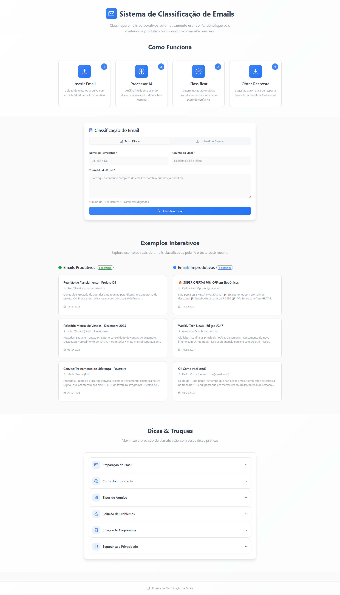

# 🚀 Classificação Automática de Emails

Sistema inteligente para classificação automática de emails corporativos do setor financeiro, utilizando inteligência artificial (OpenAI GPT) e técnicas avançadas de NLP.

## 📋 Funcionalidades

- **Classificação Automática**: Categoriza emails em "Produtivo" ou "Improdutivo"
- **Respostas Personalizadas**: Gera respostas automáticas baseadas no conteúdo específico
- **Suporte a Arquivos**: Processa emails em formato .txt e .pdf
- **Processamento Inteligente**: NLP com stemming, remoção de stop words e análise estrutural
- **API REST**: Endpoints bem documentados com FastAPI
- **Fallback Inteligente**: Sistema baseado em regras quando a IA não está disponível

## 🚀 Rodando Localmente

<details>
  <summary>Opção 1: Containers Docker</summary>

### 1. Pré-requisitos

- Docker e Docker Compose
- Chave da API OpenAI

### 2. Instalação

```bash
git clone <repository-url>
cd <nome-do-projeto>

# Configure as variáveis de ambiente
cp backend/.env.example backend/.env
cp frontend/.env.example frontend/.env
# Edite o .env do backend com sua chave da OpenAI
```

### 3. Inicialização

```bash
docker-compose up -d
```

### 4. Testes

A API estará disponível em:

- **Aplicação**: http://localhost:8000
- **Documentação**: http://localhost:8000/docs

O Frontend estará disponível em:

- **Aplicação**: http://localhost:8080

</details>

<details>
  <summary>Opção 2: Baixando todas as dependências</summary>

### 1. Pré-requisitos

- Python
- pip
- NPM
- Chave da API OpenAI

### 2. Instalação

```bash
git clone <repository-url>
cd <nome-do-projeto>

# Configure as variáveis de ambiente
cp backend/.env.example backend/.env
cp frontend/.env.example frontend/.env
# Edite o .env do backend com sua chave da OpenAI
```

### 3. Configuração backend

Crie um terminal específico para o backend e execute os comandos abaixo:

```bash

# Acessar diretório do backend
cd backend

# Crie um ambiente virtual
python3 -m venv venv
source venv/bin/activate  # Linux / macOS
venv\Scripts\activate   # Windows

# Instale as dependências
pip install -r requirements.txt
```

### 4. Configuração Frontend

Crie um terminal específico para o frontend e execute os comandos abaixo:

```bash
# Acessar diretório do frontend
cd frontend

# Instale as dependências
npm install
```

### 5. Inicialização

No terminal específico do backend, execute:

```bash
python src/main.py
```

No terminal específico do frontend, execute:

```bash
npm run dev
```

### 6. Testes

A API estará disponível em:

- **Aplicação**: http://localhost:8000
- **Documentação**: http://localhost:8000/docs

O Frontend estará disponível em:

- **Aplicação**: http://localhost:8080

</details>

## 📸 Screenshot

<details>
<summary>Página Principal</summary>



</details>

## 📊 Categorias de Classificação

### Produtivo

Emails que requerem ação específica ou resposta:

- ✅ Solicitações de suporte técnico
- ✅ Dúvidas sobre sistemas/processos
- ✅ Pedidos de informação ou status
- ✅ Relatórios de problemas
- ✅ Questões operacionais

### Improdutivo

Emails que não necessitam ação imediata:

- ✅ Mensagens de felicitação
- ✅ Agradecimentos gerais
- ✅ Mensagens sociais/pessoais
- ✅ Comunicados informativos
- ✅ Saudações sazonais

## 🛠️ Tecnologias Utilizadas

#### Backend

- Python
- FastAPI
- Pydantic
- OpenAI GPT
- NLTK
- PyPDF2
- HTTPX

#### Frontend

- React
- Typescript
- Tailwind CSS

## 📝 Licença

Este projeto está sob a licença MIT. Veja o arquivo [LICENSE](./LICENSE) para mais detalhes.
